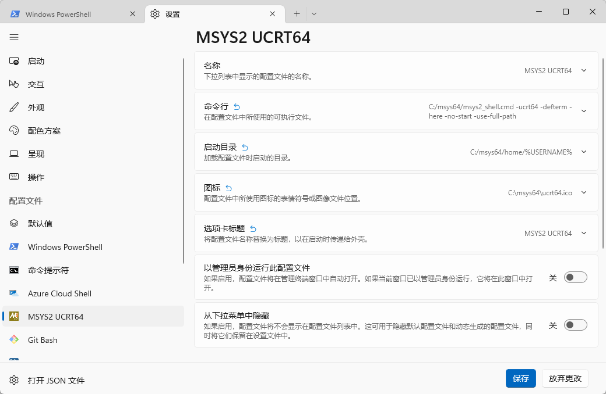

在Windows上开发C\+\+必须解决环境配置的问题。要么选择MS体系下的C\+\+开发环境，要么使用诸如Cygwin，MinGW等环境。MSYS2是一个基于Cygwin与Mingw-w64的开发平台。除了直接使用MSYS2提供的终端进行开发，MSYS2还主要用于管理开发工具。
<!--more-->
# 安装MSYS2
参照MSYS2[官网首页](https://www.msys2.org/)进行基本的安装配置。

MSYS2提供了多个不同的环境配置。本文使用最新的UCRT64环境。环境的区别见[官方文档](https://www.msys2.org/docs/environments/)。

不同于Cygwin，MSYS2需要手动通过pacman包管理器安装自己需要的工具链。

官网首页使用`pacman -S mingw-w64-ucrt-x86_64-gcc`命令安装`ucrt`环境下的gcc。要安装其他工具，例如`gdb`，需要自行手动安装：`pacman -S mingw-w64-ucrt-x86_64-gcc`。
```bash
pacman -S mingw-w64-ucrt-x86_64-gdb
```

具体开发环境可以按个人需求进行定制。

# 使用MSYS2安装的工具
MSYS2的工具可以直接在自带终端中使用，但我们一般需要在自己的编辑器或IDE中使用。此时需要获取安装目录下各类工具的路径。

MSYS2中安装的工具在软件目录下的对应位置。假如MSYS2安装在`C:\msys64`，那么我们安装的`gcc.exe`、`g++.exe` 与 `gdb.exe`均在`C:\msys64\ucrt64`的`bin`目录下。如果希望在IDE中使用MSYS2的工具链，需要自行配置路径。

为了直接在windows终端中调用工具，需要配置环境变量。将`C:\msys64\ucrt64\bin`加入到环境变量中的`PATH`下。之后可以在Windows Terminal中直接调用`g++`等工具。


直接在Windows Terminal中调用`g++`，可以正常运行。
```bash
g++ --version
```
```bash
g++.exe (Rev6, Built by MSYS2 project) 12.2.0
# ...
```

配置编辑器或IDE环境，以vscode为例。vscode配置C++环境比较复杂，一般来说能在vscode中成功配置，在其他编辑器中也没有问题。

具体vscode配置C\+\+环境并不是文章重点，不再赘述。假定已经有了可以正常运行C\+\+的vscode，只需替换环境配置。首先在`c_cpp_properties.json`中添加编译器路径与头文件路径，使得语言插件可以正常运行。

```json
// ...
"configurations": [
    {
        // ...
        "includePath": [
            "${workspaceFolder}/**",
            "C:/msys64/ucrt64/include/**"
        ],
        // ...
        "compilerPath": "C:/msys64/ucrt64/bin/g++.exe"
        // ...
    }
]
// ...
```

在`launch.json`中配置调试器路径。
```json
"configurations": [
    {
        // ...
        "miDebuggerPath": "C:\\msys64\\ucrt64\\bin\\gdb.exe", 
        // ...
}]
```

编写Hello world程序，可以正常编译运行。

```C++
#include <iostream>
using namespace std;

int main()
{
    cout << "Hello world!" << endl;
}
```
```
Hello world!
```
# 自由使用pacman安装工具
pacman是一个包管理器，一开始我们使用pacman安装了开发必要工具，接下来我们同样可以使用pacman安装其他工具。[[官方文档](https://www.msys2.org/docs/package-management/)]。


例如，我们希望安装`makefile`，可以先使用`pacman -Ss make`命令进行搜索：
```bash
ucrt64/mingw-w64-ucrt-x86_64-make 4.4-2 (mingw-w64-ucrt-x86_64-toolchain)
    GNU make utility to maintain groups of programs (mingw-w64)
```
发现需要的软件包后使用`pacman -S`命令进行安装
```bash
pacman -S mingw-w64-ucrt-x86_64-make
```

在`ucrt64/bin`目录下，搜索`make`，发现已经安装了`mingw32-make.exe`，根据个人的使用习惯可以将程序改名为`makefile.exe`。

现在，在MSYS2终端或Windows上的其他终端上都可以使用`makefile`了。
```bash
makefile -v
```
```bash
GNU Make 4.4
# ...
```
除了`-Ss`与`-S`以外，pacman的常用命令还有
```bash
# 查看已安装软件/库
pacman -Qg

# 删除已安装软件/库
pacman -R <package name>

# 从服务器下载新的软件包数据库
pacman -Sy 

# 升级所有已安装的软件包
pacman -Su

# 上面两个命令的结合
pacman -Syu
```

使用pacman安装诸如`grep`等工具，非常方便。

许多程序不限定使用的开发环境。例如`netcat`，当我们希望安装`netcat`时，搜索`pacman -Ss netcat`，会看到输出：
```
msys/gnu-netcat 0.7.1-2
    GNU rewrite of netcat, the network piping application
msys/openbsd-netcat 1.217_2-1
    TCP/IP swiss army knife. OpenBSD variant.
```
这表明这些程序不会安装在某个开发环境的`bin`下，而是在`usr/bin`下。要在终端中直接使用这些软件，将这个目录添加到环境变量中。
# 使用pacman管理库
以fmt库为例，首先使用pacman搜索fmt库
```bash
pacman -Ss fmt
```
```bash
ucrt64/mingw-w64-ucrt-x86_64-fmt 9.1.0-1 [installed]
    A modern formatting library for C++ (mingw-w64)
```
选择安装`mingw-w64-ucrt-x86_64-fmt`
```bash
pacman -S mingw-w64-ucrt-x86_64-fmt
```
此时在`./ucrt64/include`目录与`./ucrt64/lib`下即可看到`fmt`对应文件。配置好相关编辑器或IDE的路径，即可调用该库。

此处以vscode为例，在其他环境下配置的方法大同小异。要使vscode项目链接第三方库，需配置`tasks.json`，修改传递给编译器的参数，包括头文件目录，静态链接库目录，以及链接库本身。
```json
"args":[
    //...
    "-I'C:\\msys64\\ucrt64\\include'",
    "-L'C:\\msys64\\ucrt64\\lib'",
    "-lfmt",
    //...
]
```

前两者固定，后者可以在`lib`目录下检阅`.a`文件名。看到`libfmt.a`，替换为参数`-lfmt`即可。

完成配置之后，即可正常使用库，如下所示。
```c++
#include <iostream>
#include <fmt/format.h>
using namespace std;

int main()
{
    cout << fmt::format("{0}, {1}!", "Hello", "world");
}
```
```
Hello, world!
```

# 通过Windows Terminal启动MSYS2
和Git Bash一样，MSYS2使用MinTTY作为默认终端。为了更方便的操作，更好的视觉效果，我们可以使用Windows Terminal启动MSYS2。

在Windows Terminal的设置中添加新配置文件。


当配置可执行文件时，使用`msys2_shell.cmd`作为可执行文件。需要加上参数`-ucrt64 -defterm -here -no-start -use-full-path`，它们分别表示：
* 使用`UCRT64`环境
* 启动bash
* `set CHERE_INVOKING=1`
* 不通过`start`命令来启动（否则会新建窗口）
* 继承Windows中的PATH



在下拉框中选中MSYS2 UCRT64即可在终端中打开MSYS2。


