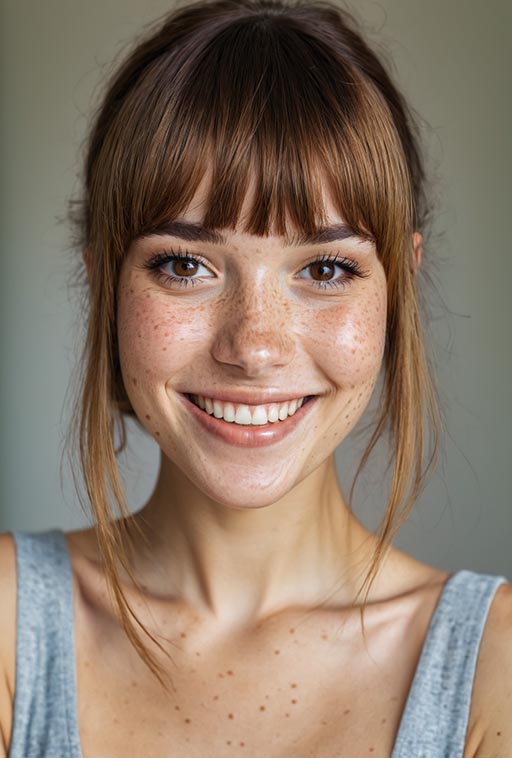
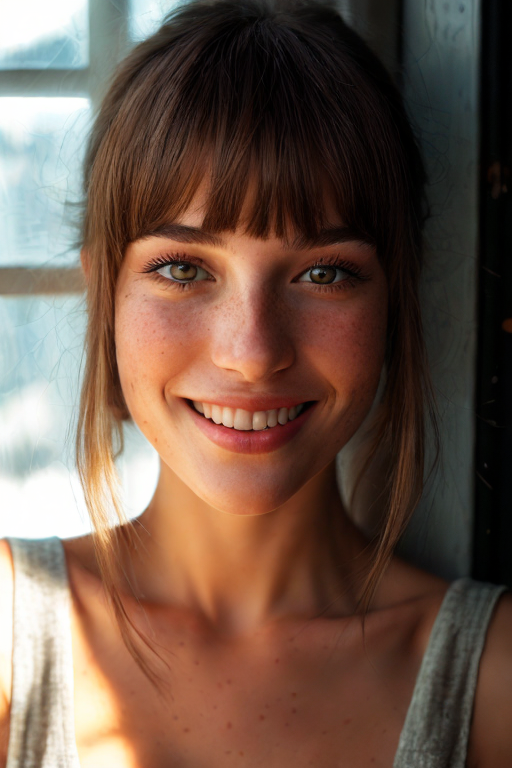
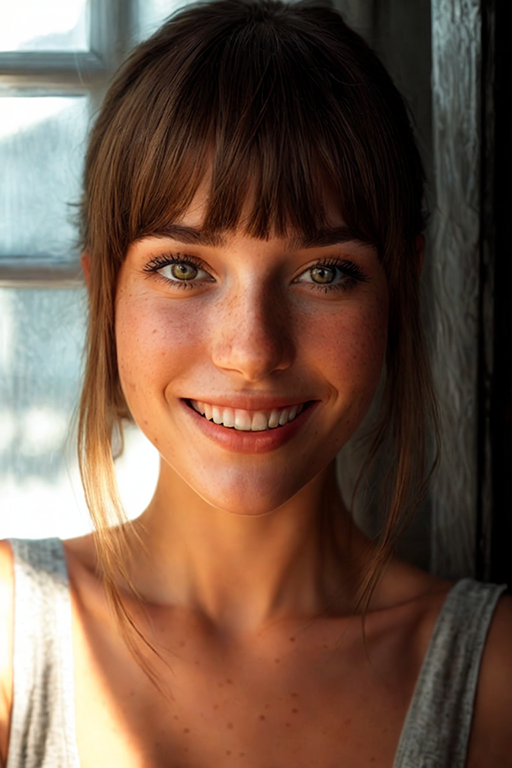

<!--more-->

[IC-Light](https://github.com/lllyasviel/IC-Light)整体效果还是比较惊艳的。我在移动端4060上使用它处理768\*512大小的图片，设置重绘倍率为1.5。当未开启重绘时，细节损失较为严重。低分辨率情况下重绘是非常有必要的。

原图，由Juggernaut XL生成。使用prompt：beautiful woman, detailed face, sunshine from window。

不开启重绘

开启1.5倍重绘

在此配置下，重绘一次大约耗时二十秒，处理速度可以接受。但是，768\*512的图片质量太低了。只要稍微提示图片尺寸，显存消耗就会大幅提升，会轻松爆显存，开启内存交换。可用性还是不够好。作为对比，SDXL在同样的配置下生成1080p质量的图片，并没有什么难度。

人脸基本偏暗，可能是模型导致的。看了一下README中提到的训练的基本逻辑，发现其训练中使用的光源均在冠状面上，导致模型没有训练顺光，故难以合成顺光的图片。对于一些特殊场景，如需要左右冷暖光对比，或者顶光烘托氛围的情况，可能比较使用。但是一般人像摄影中，总会有顺光或侧光作为主光源，此时模型就无能为力了。

使用的模型为SD1.5，既不是SDXL也不是SD3，看来实验时间比较长了。不清楚作者未来是否考虑更新到最新模型。

除此之外，项目本身的易用性也较为一般，例如不支持关闭重绘（只能设置重绘倍率为1），不支持随机种子。

## 参考文献

[1] IC-Light Github Page. https://github.com/lllyasviel/IC-Light.